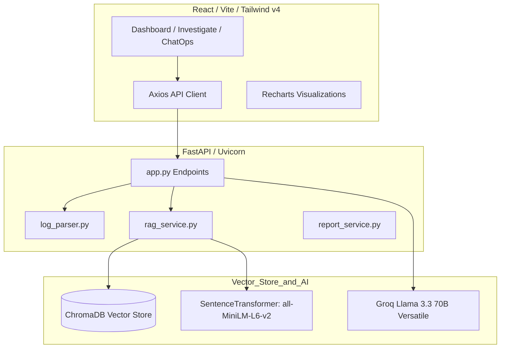
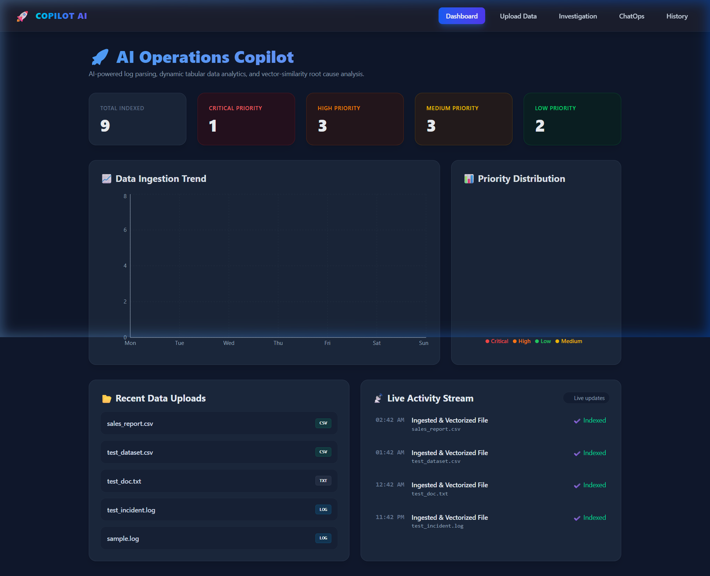
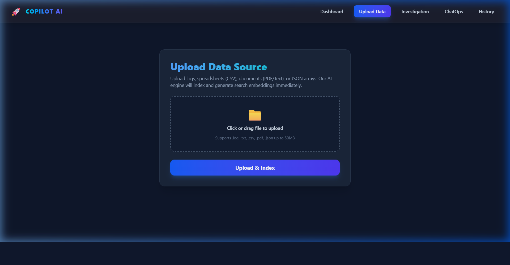
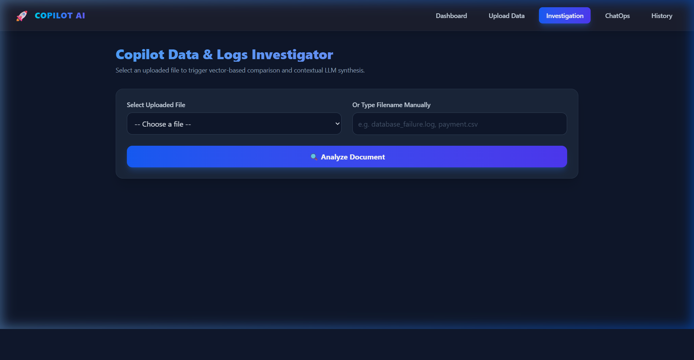
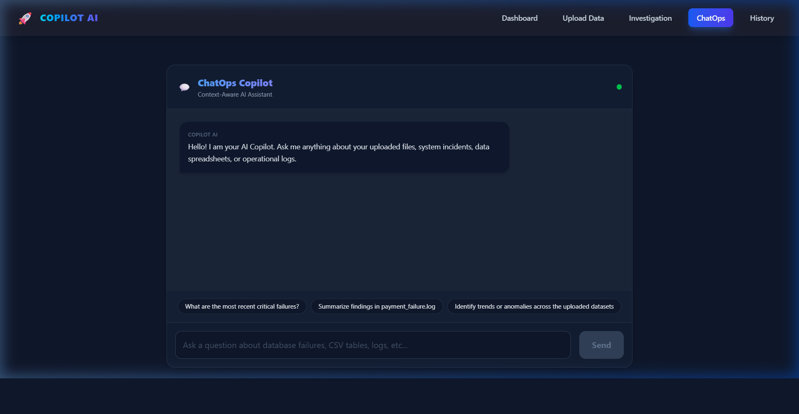

# 🚀 Copilot AI: Universal Operations & Data Analyst Assistant

An intelligent, full-stack, Retrieval-Augmented Generation (RAG) assistant designed to ingest, chunk, index, and analyze multi-format files. Leveraging a local vector database and state-of-the-art LLMs, Copilot AI classifies documents dynamically to deliver tailored, structured analytics reports.

---

## 💻 Tech Stack

*   **Frontend**: React (Vite, React Router v7, Recharts, Tailwind CSS v4)
*   **Backend**: FastAPI (Python 3.10+, Uvicorn)
*   **Vector Database**: ChromaDB (Local persistent mode)
*   **Embedding Model**: SentenceTransformers (`all-MiniLM-L6-v2`)
*   **Generative AI**: Groq API (utilizing `llama-3.3-70b-versatile`)

---

## 🌟 Key Features

1.  **Universal Data Ingestion**:
    *   **Logs & Text**: Standard line-grouped chunking (20-line windows) for log traces, terminal outputs, and text files.
    *   **Tabular Data (CSV)**: Row-level indexing with columns serialized as high-fidelity text entries.
    *   **PDF Documents**: Dynamic page-by-page text extraction utilizing `pypdf`.
    *   **JSON Lists & Dicts**: Serialized item-by-item chunking.
2.  **Context-Aware Analysis Routing**:
    *   Dynamic document classification categorizes uploads into **System Logs**, **Tabular Data**, or **General Text**.
    *   Optimal LLM prompt injection routes analysis based on document types (SRE analysis vs. Data Analyst spreadsheet audits vs. General Document synthesis).
    *   Unified JSON output mapping guarantees UI-compatibility while tailoring section headers and data cards to the input format.
3.  **ChatOps Copilot**:
    *   A context-aware chat assistant querying the local vector DB to answer operational questions with concrete evidence references.
4.  **Interactive Analytics Dashboard**:
    *   Dynamic priority distribution charts (Recharts Donut) and ingestion trends.
    *   Interactive history stream linking directly to detailed analysis views.
5.  **Professional Reports Engine**:
    *   Generates structured Markdown (`.md`) reports automatically downloaded in-browser via HTTP attachment streaming.

---

## 📐 Architecture Overview



---

## 📂 Project Structure

```text
├── backend/
│   ├── database/             # SQLite databases
│   ├── sample_data/          # Copy-pasteable files for immediate testing
│   ├── services/
│   │   ├── log_parser.py     # Universal multi-format document parser
│   │   ├── rag_service.py    # Chunking & embedding insertion service
│   │   └── report_service.py # Markdown report compiler
│   ├── uploads/              # Saved uploads directory
│   ├── vector_db/            # Persistent local ChromaDB files
│   ├── app.py                # Core FastAPI routes & controllers
│   ├── requirements.txt      # Python dependencies
│   └── index_logs.py         # Batch index verification script
│
├── frontend/
│   ├── src/
│   │   ├── components/       # Charts, Navbars, Badge indicators
│   │   ├── pages/            # Dashboard, Upload, Investigate, ChatOps, History
│   │   ├── services/         # Axios API Client definition
│   │   ├── App.jsx           # App routing routes
│   │   └── main.jsx          # Entry point
│   ├── package.json
│   └── vite.config.js
```

---

## 🚀 Installation & Local Startup

### 1. Backend Setup (FastAPI)
1. Navigate to the backend folder:
   ```bash
   cd backend
   ```
2. Create and activate a Python virtual environment:
   ```bash
   python -m venv venv
   # On Windows:
   .\venv\Scripts\activate
   # On macOS/Linux:
   source venv/bin/activate
   ```
3. Install dependencies:
   ```bash
   pip install -r requirements.txt
   ```
4. Create a `.env` file in the `backend/` folder and add your Groq API Key:
   ```env
   GROQ_API_KEY=your_groq_api_key_here
   ```
5. Start the FastAPI server:
   ```bash
   uvicorn app:app --reload --port 8000
   ```

### 2. Frontend Setup (React / Vite)
1. Navigate to the frontend folder in a new terminal:
   ```bash
   cd frontend
   ```
2. Install npm packages:
   ```bash
   npm install
   ```
3. Run the development server:
   ```bash
   npm run dev
   ```
4. Open your browser to the local URL (usually `http://localhost:5173/`).

---

## 📈 Visual Demonstrations

### Dashboard Insights
*Dynamic metric counts, priority charts, and real-time activity feeds.*


### Universal Data Ingestion
*Interactive file drag-drop zone with format validation, details summary, and direct RAG indexing triggers.*


### RAG Analysis View
*Structured analysis cards detailing findings, evidence, recommended resolutions, and strategies mapped directly to file-types.*


### ChatOps Assistant
*Context-aware message bubble interface queryable with quick action prompts.*

